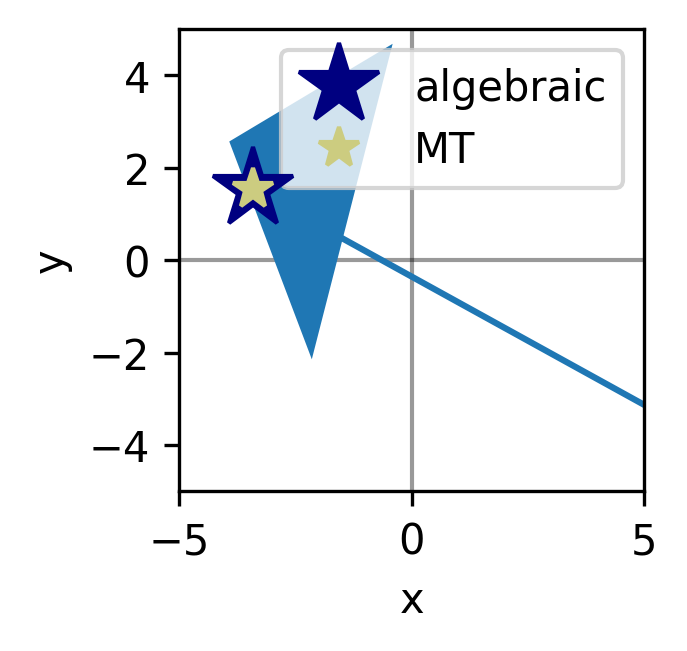
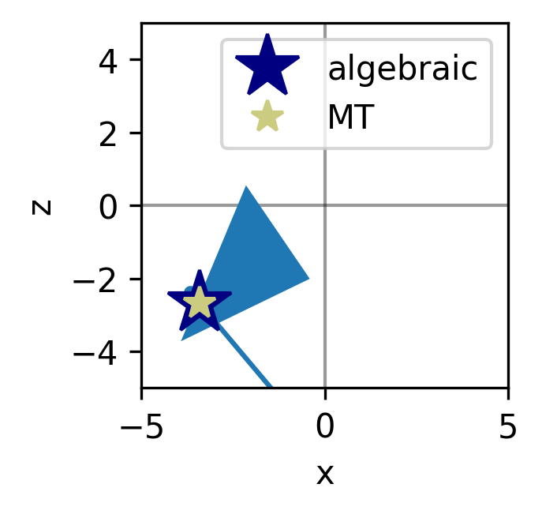
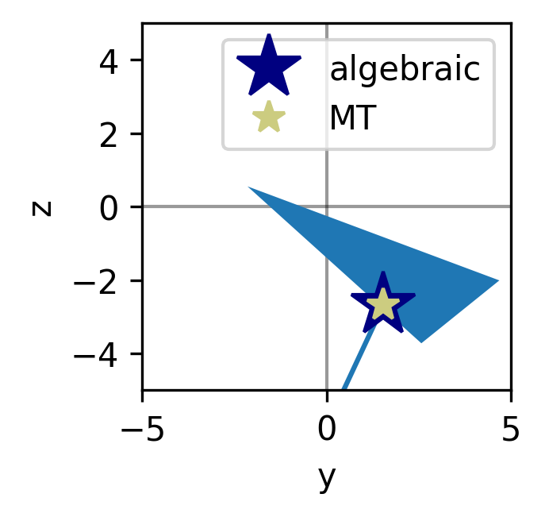

# Sweetspot - a triangle-ray interesction project

By Audun Skau Hansen (audunsh4@gmail.com) 2022

## Why triangles? A bit of context

Triangles in 3D spaces is one of the fundamental building-blocks of modern 3D graphics, and is thus the focus for quite a lot of research of efficient algorithms to draw, quantify/measure, process and transform these objects. Furthermore, modern GPUs are specifically designed to project many of these objects onto the 2D computer monitor efficiently, which means that if you can formulate any problem in a fashion similar to how 3D graphics is done (i.e. massively parallell, very little communication between the cores, GPU-friendly code), there is a great deal of perfomance payoff to gain. Core algorithms like matrix-matrix products, fourier transforms and in recent years stochastic gradient descent (for use in AI/ML) has for this reason been adapted to GPU-architectures, and it is reasonable to expect much more developement on the field.

The intersection of rays and triangles is useful for many purposes, with probably the most apparent being the projection of a triangle onto a 2D pixelated computer monitor. Given the vast amounts of triangles present in modern 3D graphics, it is clear that any such algorithm should be as optimized as possible. 

Beyond simply drawing the triangles, the same algorithm can be used in ray-tracing techniques, in order to simulate the scattering and reflection of light in 3D environments. Furthermore, the same kinds of algorithms may be used in user-interaction, to allow for point-and-click functionality in 3D environments. 

In the following, we shall give an overview of the algebraic problem and implement (1) a classic algebraic solver and (2) a more standard Möller-Trumbore algorithm [1]. We also discuss a more recent contribution to the field [2]. Finally, we conclude with some general comments and future prospects and ideas. 

**This project was given as a challenge for an application to a position for an  R&D Engineering position at Imerso, December 2022.**

---

Figure above: The algorithms has been validated in several steps, from visual inspection to automated comparisons.

## Notation and conventions

In the following, we will use boldfont letters $\mathbf{A}, \mathbf{X},\mathbf{y}$ etc.,  to represent cartesian vectors, and uppercase letters such as $R, T,...$ to represent subspaces within $\mathbb{R}^n$. Lowercase letters like $a, x, ...$ represent scalars unless stated otherwise.

## Problem overview

A *ray* $R$ in three-dimensional space ( $\mathbb{R}^3$ ) can be defined as the set of all points $\mathbf{P}$  on a line segment extending to infinity from the cartesian origin vector $\mathbf{O}$ in the normalized *direction* $\mathbf{D}$:

$$ \mathbf{P} = \mathbf{O} + a \mathbf{D},  \tag{1} $$
where $a$ is a real, positive number.

In the same space, we consider a *triangle* $T$ defined by the set of three cartesian vectors $\{ \mathbf{x}_1,\mathbf{x}_2,\mathbf{x}_3\}$. Any point on the plane spanned by the triangle, but contained within the region delimited by the lines $\{ \mathbf{x}_i,\mathbf{x}_j\}_{i\neq j}$   is an element of $T$.

The problem we are going to solve is to find the intersection 
$$ R \cap T, \tag{2} $$
where the ray intersects the triangle.

Intuitively, it makes sense to consider this a two-step procedure, consisting of first determining where (and if) the ray intersects the plane spanned by the triangle, whereby we determine whether the intersection point is within the triangle.

---

## Sources

[1] Möller, T., & Trumbore, B. (2005). Fast, minimum storage ray/triangle intersection. In _ACM SIGGRAPH 2005 Courses_ (pp. 7-es).

[2] Pichler, T. A., Ferko, A., Ferko, M., Kán, P., & Kaufmann, H. (2022). Precomputed fast rejection ray-triangle intersection. _Graphics and Visual Computing_, 200047.

